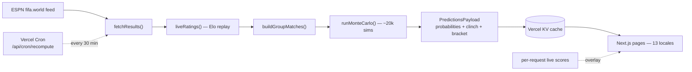

<div align="center">
  <h1>🏆 World Cup Predictor</h1>
  <p><strong>A live Monte Carlo forecast of the 2026 FIFA World Cup — title odds, advancement, knockout-round and champion probabilities, recomputed from real results as the tournament unfolds.</strong></p>

  <p>
    <a href="https://worldcup2026predictions.app">
      
    </a>
    
    
    
    
    
    
    
    
  </p>
</div>

## Overview

A self-contained statistical model of the 48-team, 12-group 2026 World Cup. It rates every team, simulates the entire remaining tournament ~20,000 times, and turns the results into readable odds: title chances, advancement probabilities, group standings, a projected knockout bracket, and a best-third-place race — alongside **mathematically-certain clinch states** (not simulation proxies). It pulls live results from ESPN's public feed, replays Elo ratings deterministically, and serves everything through a Next.js dashboard in **13 languages**.

No sign-in, nothing to configure as a visitor. The whole forecast is free and updates live.

**Live → [worldcup2026predictions.app](https://worldcup2026predictions.app)**

## Contents

- [Features](#features)
- [How the model works](#how-the-model-works)
- [Architecture](#architecture)
- [Internationalization](#internationalization)
- [Project structure](#project-structure)
- [Tech stack](#tech-stack)
- [Quick start](#quick-start)
- [Environment variables](#environment-variables)
- [Commands](#commands)
- [Live data &amp; the recompute cron](#live-data--the-recompute-cron)
- [Deployment](#deployment)
- [License](#license)

## Features

- **World Football Elo ratings** seeded from ~49,000 international matches and updated after every result — tournament-weighted, scaled by margin of victory, with a host-nation advantage.
- **Poisson / Dixon-Coles scorelines** mapping each Elo gap to expected goals, win/draw/loss probabilities, and a full scoreline distribution (needed for goal-difference tiebreakers).
- **20,000-iteration Monte Carlo** over every remaining match, with per-iteration rating uncertainty so the tails stay honest. Deterministic given a seed.
- **2026 FIFA tiebreakers** implemented exactly — including the rule change that applies head-to-head *before* overall goal difference — with recursive resolution of multi-team ties.
- **Verified 495-row FIFA Annex C** third-place assignment: the model selects the 8 best third-placed teams and routes each to the correct Round-of-32 slot every iteration.
- **Probability vs. certainty, kept distinct.** Percentages come from the simulation; a ✓ comes from exhaustive [clinch enumeration](lib/sim/clinch.ts) and appears only when no remaining result can overturn an outcome. The UI never presents a sim probability as definitive.
- **Live results from ESPN**, with in-progress matches surfaced and an "if it ends like this" provisional-standings view.
- **Calendar + bracket + schedule** views, a best-third-place race with hover detail, and per-match prediction pages.
- **13 languages** with localized routing, team/country names, hreflang, and RTL (Arabic).
- **Installable PWA** with dynamic OG images for rich social shares; **local-time everywhere**, formatted in the site language.

## How the model works

The full methodology is documented in-app at **[/methodology](https://worldcup2026predictions.app/methodology)**. In short, every remaining match runs through this pipeline ([`lib/predictions.ts`](lib/predictions.ts)):

1. **Ingest** completed results from ESPN's `fifa.world` scoreboard (no API key).
2. **Rate** — pre-tournament Elo with every completed match *replayed* via the World-Football Elo update (deterministic, no drift).
3. **Model** each fixture: Elo gap → two Poisson goal rates → Dixon-Coles W/D/L + sampled scorelines; knockouts add extra-time and a penalty-shootout model.
4. **Simulate** ~20,000 tournaments: build the 12 group tables under the 2026 tiebreakers, select + assign the 8 best thirds via Annex C, and play the bracket to a champion.
5. **Report** probabilities (group winner / advance / reach-each-round / champion) + clinch states + per-match projections.

It backtests at a ranked probability score around **0.178** overall (bookmaker-competitive). The simulation engine under [`lib/sim/`](lib/sim/) is pure, framework-agnostic, and fully unit-tested.

## Architecture



The cached payload in KV is **global/shared** — one model run serves every locale and every visitor. Pages are `force-dynamic` server components that read the cached payload and overlay live in-progress scores per request. `PRED_KEY` in [`lib/kv.ts`](lib/kv.ts) is versioned so a payload-shape change invalidates stale cache.

## Internationalization

13 locales (English + Spanish, Portuguese, French, German, Italian, Russian, Arabic, Hindi, Indonesian, Japanese, Korean, Chinese), built to scale: **adding a language is one entry in [`lib/i18n/config.ts`](lib/i18n/config.ts) + one translated catalog file** — everything locale-aware (routing, hreflang, sitemap, the switcher) iterates that config.

- **Routing** — English at the root (`/bracket`), every other locale prefixed (`/es/bracket`); a Next 16 [`proxy.ts`](proxy.ts) rewrites/stamps the locale. Slugs stay English-stable across locales.
- **Translation** — `await getT()` in server components, `useT()` in client components, sharing one catalog + a dependency-free ICU-subset formatter (interpolation + `Intl.PluralRules`-correct plurals). Per-key English fallback.
- **Native** — UI copy, methodology prose, **team/country names**, dates (site-locale month/day names, viewer timezone), hreflang + `x-default`, and RTL for Arabic.

## Project structure

```text
app/
  [lang]/         localized routes: overview, groups, bracket, schedule, calendar, match/[match], team/[slug], group/[letter], methodology
  api/            cron recompute, predictions/data JSON, auth (BetterAuth)
  sitemap.ts robots.ts manifest.ts icon.tsx   metadata routes (locale-aware sitemap w/ hreflang)
proxy.ts          Next 16 locale router (middleware → proxy)

lib/
  sim/            pure simulation engine — elo, poisson, standings (2026 tiebreakers),
                  thirdPlace (Annex C), knockout, clinch, simulate, rng
  data/           verified static data — teams + pre-tournament Elo, schedule, bracket, 495-row table
  i18n/           config-driven i18n — config, server (getT), provider (useT), messages/*.json
  predictions.ts  end-to-end pipeline   espn.ts  live ingest + replay   kv.ts  cache   live.ts  overlay

components/       UI — bracket, calendar, live rail, standings, third-place race, language switcher, ...
```

## Tech stack

- **[Next.js 16](https://nextjs.org)** (App Router, React 19, server components, `next/og` dynamic images)
- **[Tailwind CSS v4](https://tailwindcss.com)** + shadcn-style components, dark stadium-night theme
- **TypeScript** + **[Bun](https://bun.sh)**
- **[Vercel](https://vercel.com)** hosting + **Vercel Cron** (recompute) + **Vercel KV** (Upstash Redis) cache
- **Neon Postgres** + **BetterAuth** (optional, dormant auth backend)
- **Vitest** (engine unit tests)

## Quick start

Requires [Bun](https://bun.sh).

```bash
bun install
cp .env.example .env.local   # all values are optional in dev (see below)
bun run dev                  # http://localhost:3000
```

The app runs with **no env vars set** — it computes predictions on demand (~6 s first render). KV is recommended so renders read a cache instead of recomputing.

## Environment variables

| Variable | Required | Purpose |
|----------|----------|---------|
| `KV_REST_API_URL` / `KV_REST_API_TOKEN` | recommended | Vercel KV / Upstash Redis REST — cached prediction payload |
| `CRON_SECRET` | recommended | Bearer token protecting `/api/cron/recompute` |
| `NEXT_PUBLIC_STUBHUB_CAMREF` | optional | Affiliate camref — wraps ticket links when set (public, not secret) |
| `DATABASE_URL` | optional | Postgres (Neon) for the dormant auth backend |
| `BETTER_AUTH_SECRET` / `BETTER_AUTH_URL` | optional | BetterAuth (magic-link) config |
| `RESEND_API_KEY` / `EMAIL_FROM` | optional | Auth emails (without it, magic links print to the server console) |

## Commands

```bash
bun run dev          # Next.js dev server
bun run build        # production build
bun run typecheck    # tsc --noEmit (build does NOT type-check)
bun run lint         # eslint
bun run test         # vitest run (tiebreakers, third-place table, bracket, match model, full sim)
bun run format       # prettier --write
```

Dev/QA scripts (run directly with `bun`):

```bash
bun run scripts/bench.ts          # benchmark the Monte Carlo at 10k/20k/50k iters
bun run scripts/smoke.ts          # end-to-end: live ESPN fetch → computePredictions → KV roundtrip
bun run scripts/i18n-validate.ts  # verify every locale catalog has parity with en.json
python3 scripts/qa.py             # assert invariants against the deployed /api/data
```

## Live data & the recompute cron

`GET /api/cron/recompute` pulls completed results from ESPN's public `fifa.world` feed (no key), rebuilds ratings, runs the Monte Carlo, and writes the payload to KV. Vercel Cron calls it on a schedule (see [`vercel.json`](vercel.json)), authenticating with `CRON_SECRET`. Pages read the cached payload; **live in-progress scores are fetched per request** so they update in real time independently of the cron. The cron stops automatically after the tournament so it doesn't poll ESPN forever.

## Deployment

Deploys on Vercel out of the box: connect the repo, set the environment variables above, add a Cron job hitting `/api/cron/recompute`, and (for the locale sitemap + hreflang) set the production domain. Any platform supporting Next.js 16 + a scheduled HTTP request will work.

## License

[MIT](LICENSE). Live data via ESPN. Not affiliated with FIFA. Ratings and predictions are for entertainment.
